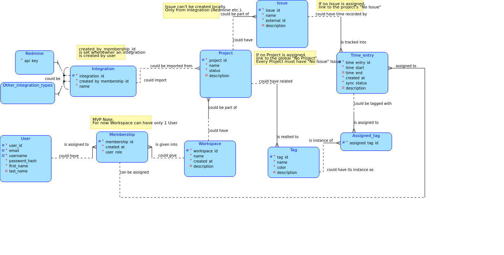

# Time Tracking Platform (Toggl Clone)


> **About this project:** This is a time-tracking platform developed as part of a university project. It serves as an advanced alternative to commercial tools like Toggl Track, removing external API rate limits and providing native integration with ticketing systems (such as Redmine).

## My Role & Contributions

Within this 6-person engineering team, I served as the **Web Specialist & UI/UX Designer**.

**My core responsibilities and achievements include:**

- **UI/UX Design:** Designed a modern, distraction-free interface prioritizing speed. The core design philosophy was "efficiency above all else"—reducing the number of mouse clicks compared to Toggl and ensuring a **keyboard-first** interaction model.
- **Frontend Architecture:** Built the frontend ecosystem from the ground up using **Nuxt 3** and **Vue.js**, leveraging **Pinia** for robust state management.
- **Cross-Platform Delivery:** Integrated **Tauri** to wrap the web application into a native desktop application with system tray capabilities and idle detection.
- **Component Engineering:** Developed accessible, reusable UI components using **TailwindCSS** and **Nuxt UI**.
- **Process Automation:** Ensured seamless frontend and backend (Micronaut/Kotlin) synchronization for "Offline-First" capabilities.

---

## The Concept & Features

The platform was built with a strict emphasis on performance, keyboard-driven navigation, and contextual automation (predicting user intent to skip confirmation dialogs).

### Key Features

- **Cross-Platform Sync:** Real-time data transfer between web, desktop, and mobile platforms. Start tracking on your PC, stop it on your phone.
- **Timer & Manual Modes:** A classic "start/stop" timer alongside a seamless manual entry mode for logging forgotten hours.
- **Organization & Redmine Integration:** Full categorization using Projects, Clients, Tags, and Colors, natively tied to Redmine issues.
- **Offline-First:** Track your time without an internet connection. The app automatically syncs local data with the PostgreSQL backend once online.
- **Desktop Idle Detection:** A smart desktop client feature that warns you if you leave a timer running while away from your computer.
- **Focus Tools:** Built-in Pomodoro timer strategies for maximum productivity.

---

## Technology Stack

- **Framework:** [Nuxt 3](https://nuxt.com/) (Vue.js)
- **UI & Styling:** [Nuxt UI](https://ui.nuxt.com/), [Tailwind CSS](https://tailwindcss.com/)
- **State Management:** [Pinia](https://pinia.vuejs.org/)
- **Desktop Client:** [Tauri](https://tauri.app/) (Rust-based WebView wrapper)
- **Testing:** [Vitest](https://vitest.dev/), [Playwright](https://playwright.dev/)
- **Package Manager:** [pnpm](https://pnpm.io/)

---

## System Design & Architecture

As part of the project's software engineering lifecycle, we developed comprehensive documentation, including use cases, domain models, and activity diagrams.

_Note: The original full documentation is hosted on our internal school GitLab wiki, but key architecture diagrams are included below._

### Use Cases & Activity Diagrams

_(These diagrams are pulled directly from our project documentation to illustrate system architecture)_

#### Database Architecture


*Figure 1: Core Database Schema and entity relationships.*

#### Time Tracking Activity


*Figure 2: Activity Diagram mapping the start/stop state machine when tracking time.*

#### Redmine Sync Architecture


*Figure 3: Activity Diagram showing the automatic background synchronization with Redmine.*

### Visual Gallery

_(Placeholders for your UI screenshots. Simply save your PNGs to `docs/screenshots/` and uncomment these lines)_

<!--

*Figure 3: Main dashboard and active timer view.*


*Figure 4: Client and Project organization interface.*
-->

---

## ⚙️ Setup & Local Development

Want to run the frontend locally? Ensure you have Node.js and `pnpm` installed.

### 1. Install Dependencies

```bash
pnpm install
```

### 2. Start Web Server

Run the development server (runs on `http://localhost:3000`):

```bash
pnpm dev
```

### 3. Run Desktop App (Tauri)

To launch the native desktop application (requires Rust toolchain):

```bash
pnpm tauri dev
```
