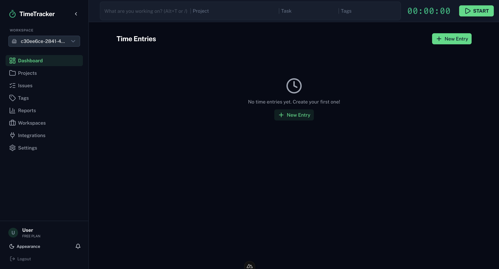

# ⏱️ Time Tracking Platform — Frontend

> A production-deployed, keyboard-first time-tracking platform built as an advanced alternative to Toggl Track. Features native Redmine integration, offline-first sync, a Tauri desktop app, and a full CI/CD pipeline from lint to AWS deployment.

<!-- Replace with a real screenshot of the running app -->



[](https://vuejs.org/)
[](https://nuxt.com/)
[](https://www.typescriptlang.org/)
[](https://tauri.app/)
[](https://www.docker.com/)
[](https://www.sonarqube.org/)
[](LICENSE)

---

## 🎯 About This Project

A time-tracking platform developed as a university engineering project (SP1) at **FIT CTU Prague** by a 6-person team. It solves two real problems with commercial tools like Toggl:

1. **API rate limits** — commercial tools cap how often you can sync with project management tools
2. **Context-switching** — we embed Redmine issue search directly in the timer widget

The system is **currently deployed and running** on AWS. This repository is the **frontend** (Nuxt 4 / Vue 3). The REST API backend is a separate Micronaut/Kotlin service compiled to a GraalVM native binary.

---

## 👩‍💻 My Role & Contributions

Within the 6-person team, I served as **Web Specialist & UI/UX Designer** and was the primary owner of this frontend repository.

| Responsibility              | Details                                                                                                                                          |
| --------------------------- | ------------------------------------------------------------------------------------------------------------------------------------------------ |
| **UI/UX Design**            | Designed the interface around "efficiency above all else" — fewer clicks than Toggl, full keyboard navigation via Tab/Enter and global shortcuts |
| **Frontend Architecture**   | Built the frontend from scratch: Nuxt 4, Vue 3, Pinia state management, TypeScript throughout                                                    |
| **Cross-Platform Delivery** | Integrated Tauri to ship a native desktop app with system-tray support and idle detection                                                        |
| **Component Engineering**   | Built accessible, reusable components with TailwindCSS and Nuxt UI                                                                               |
| **CI/CD Pipeline**          | Designed and owns the full GitLab CI pipeline: lint → type-check → test coverage → SonarQube → Docker → AWS                                      |
| **Process & Workflow**      | Authored [CONTRIBUTING.md](CONTRIBUTING.md) — enforced branch naming, mandatory code review, and CI-green-before-merge rules                     |
| **Backend Coordination**    | Defined REST API contracts with the Kotlin/Micronaut backend team; coordinated frontend↔backend integration for offline-first behavior           |

---

## ✨ Key Features

- **⌨️ Keyboard-First UX** — Full Tab/Enter navigation, global shortcuts, command palette — designed to never require a mouse
- **🔗 Redmine Integration** — Search and link Redmine issues directly from the timer widget; no tab-switching
- **📱 Cross-Platform Sync** — Start a timer on web, stop it on desktop; data syncs in real time via the REST API
- **⏺️ Timer & Manual Modes** — Classic start/stop timer _and_ a manual entry mode for retroactive logging
- **✈️ Offline-First** — Track without internet; auto-syncs to PostgreSQL backend when connectivity returns
- **🖥️ Desktop Idle Detection** — Alerts you when a timer has been running while you were away from the keyboard
- **🍅 Focus Tools** — Built-in Pomodoro timer to structure focused work sessions
- **🗂️ Full Organization** — Projects, Clients, Tags, and Colors for structured time reporting

---

## 🏗️ Architecture Overview

```
┌─────────────────────────────────────────────────────┐
│                  CLIENT SIDE                        │
│                                                     │
│  ┌───────────────────┐   ┌──────────────────────┐  │
│  │   Nuxt 4 Web App  │   │  Tauri Desktop App   │  │
│  │  Vue 3 + Pinia    │   │  (Rust wrapper)      │  │
│  │  TailwindCSS      │   │  System tray         │  │
│  │  Nuxt UI          │   │  Idle detection      │  │
│  └────────┬──────────┘   └──────────┬───────────┘  │
└───────────┼──────────────────────────┼──────────────┘
            │     REST API + JWT Auth  │
            ▼                          ▼
┌─────────────────────────────────────────────────────┐
│              Micronaut / Kotlin Backend              │
│         GraalVM native binary · PostgreSQL          │
│              Deployed on AWS EC2                     │
└─────────────────────────────────────────────────────┘
```

**Frontend stack:** Nuxt 4 · Vue 3 · Pinia · TypeScript · TailwindCSS · Nuxt UI  
**Desktop:** Tauri 2 (Rust) wrapping the Nuxt app  
**Quality:** ESLint · Prettier · Husky (pre-commit hooks) · Vitest · SonarQube SAST  
**CI/CD:** GitLab CI → Kaniko Docker build → AWS EC2 via SSH

---

## 🔄 Development Lifecycle (SDLC)

This project followed a professional team software development lifecycle with enforced quality gates at every stage.

### Branching Strategy — GitHub Flow

```
main          ← production-only, protected, auto-deploys to AWS
  └─ develop  ← stable integration branch, auto-deploys to staging
       └─ feature/*, fix/*, chore/*   ← all work happens here
```

**Rules (enforced via branch protection + CI):**

- ❌ No direct pushes to `develop` or `main` — ever
- ✅ All changes go through a **Merge Request**
- ✅ Requires **approval from a second team member** (mandatory code review)
- ✅ CI pipeline must be **green** before merge is allowed

### CI/CD Pipeline (GitLab CI)

Every push triggers a pipeline with 6 stages:

```
test ──► build ──► sonarqube-check ──► sonarqube-vulnerability-report ──► dockerize ──► deploy
```

| Stage                              | What Happens                                                                                      |
| ---------------------------------- | ------------------------------------------------------------------------------------------------- |
| **test**                           | `pnpm lint` · `pnpm typecheck` · `pnpm test:coverage` (Vitest + coverage report)                  |
| **build**                          | `nuxt build` — production SSR build, artifacts cached                                             |
| **sonarqube-check**                | Static analysis for bugs, code smells, and security vulnerabilities                               |
| **sonarqube-vulnerability-report** | SAST vulnerability export for GitLab Security Dashboard                                           |
| **dockerize**                      | Kaniko builds Docker image, pushes to GitLab Container Registry (tagged by commit SHA + `latest`) |
| **deploy**                         | SSH into AWS EC2: pull new image → stop old container → run new container                         |

**Deployment runs automatically on every merge to `main`** — zero-downtime rolling replacement via Docker.

### Pre-Commit Hooks (Husky + lint-staged)

Before any commit is accepted locally:

- ESLint auto-fixes JavaScript/TypeScript/Vue files
- Prettier auto-formats all modified files

This guarantees the CI lint/format stage never fails due to style issues.

---

## 🧪 Testing Strategy

| Type                | Tool                       | What's Tested                                              |
| ------------------- | -------------------------- | ---------------------------------------------------------- |
| **Unit tests**      | Vitest                     | Pinia stores, composables, utility functions               |
| **Component tests** | Vue Test Utils + happy-dom | Component rendering and interactions                       |
| **Coverage**        | `@vitest/coverage-v8`      | Coverage report generated on every CI run                  |
| **E2E tests**       | Playwright                 | Key user flows (timer start/stop, login, time entry)       |
| **Type safety**     | `nuxt typecheck` (vue-tsc) | Full TypeScript checking across all `.vue` and `.ts` files |
| **SAST**            | SonarQube                  | Static security analysis on every MR and `main` push       |

---

## 🚀 Getting Started

### Prerequisites

- **Node.js** v18+
- **pnpm** (`npm install -g pnpm`)
- **Docker** (optional, to run the backend locally)

### Frontend Development

```bash
# Install dependencies
pnpm install

# Copy environment config
cp .env.example .env.local
# Edit .env.local: set NUXT_PUBLIC_API_BASE to the backend URL

# Start dev server
pnpm dev
# → http://localhost:3000
```

### Available Scripts

```bash
pnpm dev              # Start development server
pnpm build            # Production build
pnpm preview          # Preview production build locally
pnpm lint             # Run ESLint
pnpm lint:fix         # Auto-fix lint errors
pnpm typecheck        # TypeScript type checking
pnpm test             # Run unit tests (Vitest)
pnpm test:coverage    # Run tests with coverage report
pnpm format           # Prettier format all files
```

### Desktop App (Tauri)

```bash
pnpm tauri dev        # Development (web + native window)
pnpm tauri build      # Build native binary (.exe / .dmg / .deb)
```

### Backend API

The backend is a separate Micronaut/Kotlin service. It is deployed on AWS and provides the REST API this frontend consumes. See the [backend repository](https://gitlab.fit.cvut.cz/shevcvla/time-tracking-ekosystem) for local setup instructions.

API documentation (Swagger UI) is available at `http://localhost:8080/swagger-ui/` when running locally.

---

## 📁 Project Structure

```
sp1_fe_project/
├── app/
│   ├── components/     # Reusable UI components (timer widget, entry list, modals…)
│   ├── pages/          # Route-based pages (dashboard, settings, login…)
│   ├── stores/         # Pinia stores (timer, time entries, auth, projects…)
│   ├── services/       # API service layer (abstracts all REST calls)
│   ├── composables/    # Shared Vue composables
│   └── types/          # Shared TypeScript type definitions
├── src-tauri/          # Tauri desktop app (Rust, system-tray, idle detection)
├── tests/              # Vitest unit tests + Playwright E2E tests
├── public/             # Static assets
├── docs/               # Screenshots and documentation
├── .gitlab-ci.yml      # Full CI/CD pipeline (6 stages)
├── .husky/             # Pre-commit hooks (lint + format)
├── Dockerfile          # Production container (served via nginx)
├── CONTRIBUTING.md     # Team workflow rules (branching, MR, code review)
└── sonar-project.properties  # SonarQube project config
```

---

## 🤝 Contributing

Please read [CONTRIBUTING.md](CONTRIBUTING.md) before submitting a pull request. Key rules:

- Branch from `develop`, not `main`
- All changes require a Merge Request + peer code review
- CI must be green before merge

---

## 📜 License

This project is licensed under the [MIT License](LICENSE).
